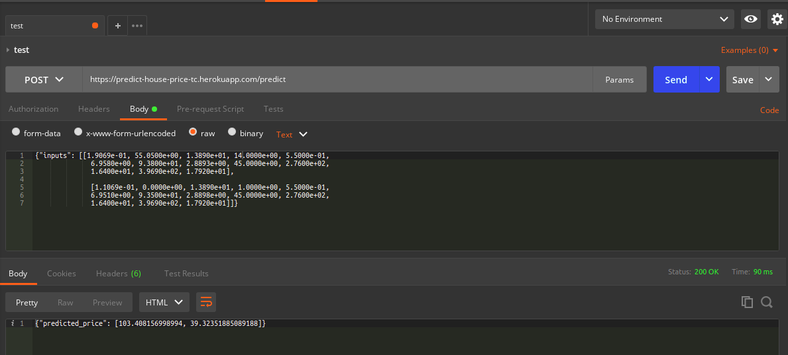

# House Price Prediction
A FlaskAPI able to predict the price of houses in Boston

It supports a POST request

Your input array should take in a 1D array of 13 values

## To Use
- Go to https://predict-house-price-tc.herokuapp.com/predict on Postman
- Enter a sample input array

 ```
 {"inputs": [
     [1.9069e-01, 55.0500e+00, 1.3890e+01, 14.0000e+00, 5.5000e-01, 
     6.9580e+00, 9.3800e+01, 2.8893e+00, 45.0000e+00, 2.7600e+02,
     1.6400e+01, 3.9690e+02, 1.7920e+01], 
              
    [1.1069e-01, 0.0000e+00, 1.3890e+01, 1.0000e+00, 5.5000e-01,
    6.9510e+00, 9.3500e+01, 2.8898e+00, 45.0000e+00, 2.7600e+02,
    1.6400e+01, 3.9690e+02, 1.7920e+01]
    ]
    }
```
- Pass the information through the POST method to get the result which is the prediction value



